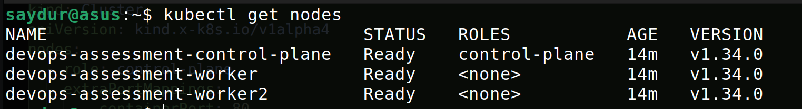
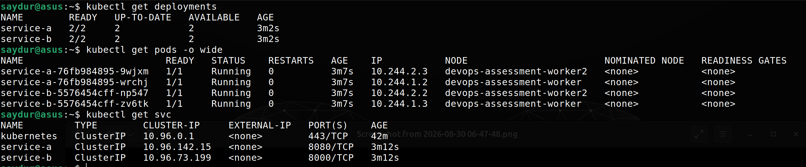
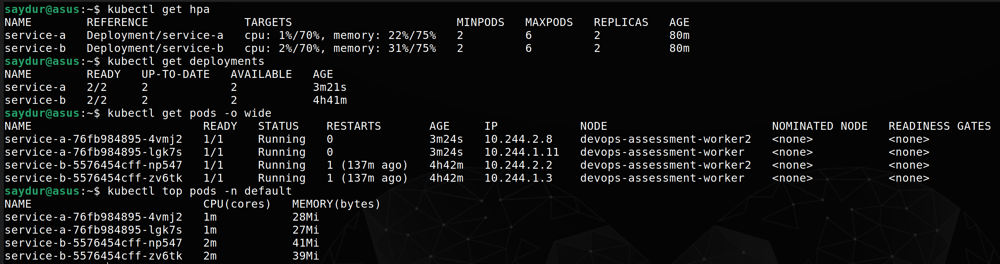
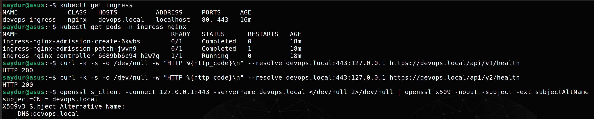
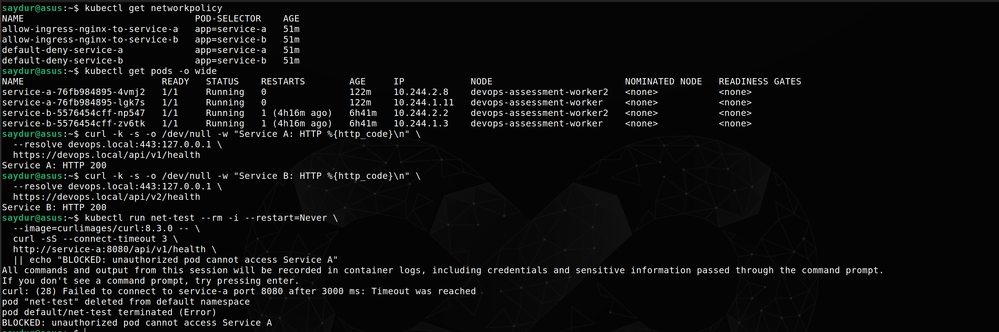
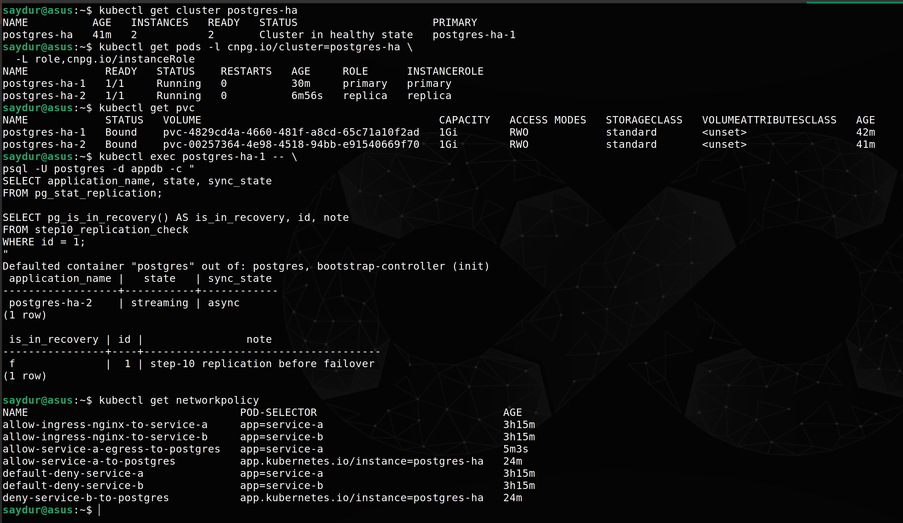
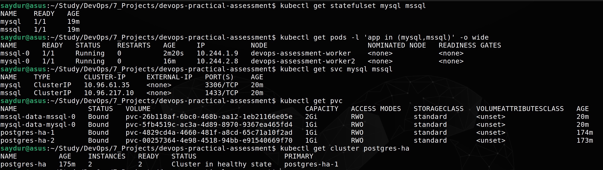
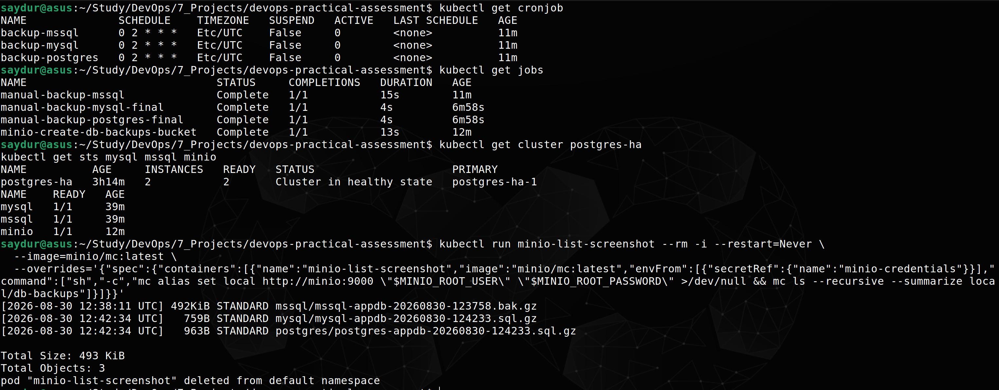
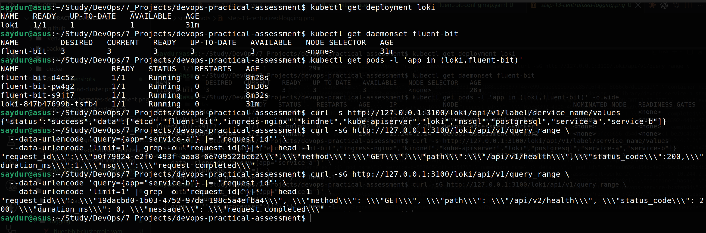
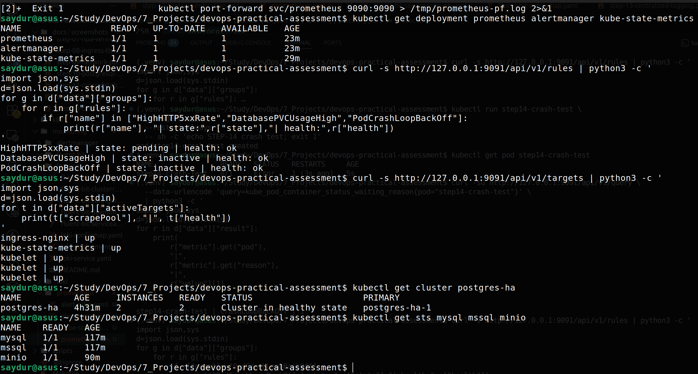

# DevOps Practical Assessment

A small polyglot microservices sample used for DevOps practical exercises.

## Short Description

This repository contains two simple services to exercise containerization, observability, and deployment workflows.

## Current Progress

- [x] STEP-01 Project structure setup
- [x] STEP-02 Service A implementation
- [x] STEP-03 Service B implementation
- [x] STEP-04 Docker containerization
- [x] STEP-05 Local Kubernetes cluster setup
- [x] STEP-06 Kubernetes application deployment
- [x] STEP-07 Kubernetes horizontal pod autoscaling
- [x] STEP-08 Kubernetes Ingress and TLS routing
- [x] STEP-09 Kubernetes Zero-Trust NetworkPolicy
- [x] STEP-10 PostgreSQL High Availability
- [x] STEP-11 MySQL and SQL Server Persistent Workloads
- [x] STEP-12 Automated Database Backup and S3-Compatible Storage
- [x] STEP-13 Centralized Logging with Fluent Bit and Loki
- [x] STEP-14 Prometheus Monitoring and Alerting
- [x] STEP-15 GitHub Actions CI/CD Pipeline
- [x] STEP-16 Kustomize Staging and Production Overlays
- [x] STEP-17 One-Click Deployment Automation

## Service A (Node.js + Express)

- Location: docker/service-a
- Tech: Node.js, Express
- Endpoints:
	- GET /api/v1/health -> {"status":"healthy","service":"service-a"}
	- GET /api/v1/users -> returns sample users
	- GET /api/v1/error -> returns HTTP 500 (for alert testing)

## Service B (Python + FastAPI)

- Location: docker/service-b
- Tech: Python 3, FastAPI, Uvicorn
- Endpoints:
	- GET /api/v2/health -> {"status":"healthy","service":"service-b"}
	- GET /api/v2/orders -> returns sample orders
	- GET /api/v2/error -> returns HTTP 500 (for alert testing)

## How to run Service B locally (developer)

1. Create a Python virtual environment and activate it:

```bash
python3 -m venv .venv
source .venv/bin/activate
```

2. Install dependencies:

```bash
pip install -r docker/service-b/requirements.txt
```

3. Start the server:

```bash
uvicorn docker.service-b.main:app --host 127.0.0.1 --port 8000
```

4. Test endpoints:

```bash
curl http://127.0.0.1:8000/api/v2/health
curl http://127.0.0.1:8000/api/v2/orders
curl http://127.0.0.1:8000/api/v2/error
```

## STEP-04 Docker containerization notes

This step adds multi-stage Dockerfiles for both services and follows production-oriented best practices:

- Multi-stage builds: build dependencies in a builder image, copy only runtime artifacts into a minimal runtime image.
- Build vs runtime: the builder contains tooling (npm, pip, compilers), the final image is minimal/distroless.
- Minimal/distroless runtime: reduces attack surface and removes shells and package managers from runtime images.
- Non-root execution: final containers are configured to run as UID 10001 (numeric user) to avoid running as root.
- Docker layer caching: package manifests are copied before application code to improve cache reuse during iterative builds.

Service container ports:
- Service A: `8080`
- Service B: `8000`

## STEP-05 Local Kubernetes cluster (kind)

- Cluster name: `devops-assessment`
- Node topology: 1 control-plane, 2 workers
- Host port mappings configured on control-plane node: host `80` -> container `80`, host `443` -> container `443`
- The cluster is local (kind) and intended for assessment validation; services are not deployed by default.

Create the cluster:

```bash
kind create cluster --name devops-assessment --config k8s/kind-config.yaml
```

Delete the cluster:

```bash
kind delete cluster --name devops-assessment
```

Validation commands:

```bash
kubectl cluster-info --context kind-devops-assessment
kubectl get nodes -o wide
kubectl config current-context
```

### Cluster Verification

The following screenshot shows the cluster verification output (`kubectl get nodes -o wide`) used during validation:



## STEP-06 Kubernetes application deployment

- Namespace: `default`
- Deployments: `service-a`, `service-b`
- Replicas: 2 each
- Resource requests: `cpu: 100m`, `memory: 128Mi`
- Resource limits: `cpu: 500m`, `memory: 256Mi`
- Service A health probe: `/api/v1/health`
- Service B health probe: `/api/v2/health`
- Rolling update: `maxSurge: 25%`, `maxUnavailable: 0`
- Pod anti-affinity: `requiredDuringSchedulingIgnoredDuringExecution`
- Topology key: `kubernetes.io/hostname`

Apply manifests (from repo root):

```bash
kubectl apply -f k8s/base/service-a/deployment.yaml
kubectl apply -f k8s/base/service-a/service.yaml
kubectl apply -f k8s/base/service-b/deployment.yaml
kubectl apply -f k8s/base/service-b/service.yaml
```

Verify deployments and pods:

```bash
kubectl get deployments
kubectl get pods -o wide
kubectl get svc
```

Port-forward for testing (run in separate terminals):

```bash
# Service A
kubectl port-forward svc/service-a 8080:8080 --address 127.0.0.1
# Service B
kubectl port-forward svc/service-b 8000:8000 --address 127.0.0.1
```

Service B runtime note:
- Distroless Python (`gcr.io/distroless/python3:3.12`) was considered and preferred for minimal attack surface.
- In environments where the distroless manifest is not available, this repository falls back to `python:3.12-slim` as a minimal, compatible runtime. Build tools and dependencies remain isolated in the builder stage at `/install` and are copied into the final image only as needed.

Images built locally (after verification):
- `devops-service-a:step04` — 204MB
- `devops-service-b:step04` — 159MB

Example Docker build and run commands:

```bash
# From repository root
docker build -f docker/service-a/Dockerfile -t devops-service-a:step04 docker/service-a
docker run --rm -p 8080:8080 --name t-service-a devops-service-a:step04

docker build -f docker/service-b/Dockerfile -t devops-service-b:step04 docker/service-b
docker run --rm -p 8000:8000 --name t-service-b devops-service-b:step04
```

Multi-stage build explanation:
- The builder stage installs dependencies and compiles or prepares artifacts. The final runtime stage copies only the minimal runtime artifacts needed to run the app (application code and installed packages), keeping image size and attack surface small.

Build vs runtime image:
- Builder: contains package managers and build tools (`npm`, `pip`) and the full dependency installation step.
- Runtime: contains only the runtime interpreter and the application artifacts copied from the builder stage; runs as non-root `UID 10001` and exposes the runtime port.
### Deployment Verification

The following output verifies that both microservices are running with two healthy replicas distributed across the Kubernetes worker nodes.



## STEP-07 Kubernetes Horizontal Pod Autoscaling

Horizontal Pod Autoscaling (HPA) is configured for both microservices using the Kubernetes `autoscaling/v2` API.

### HPA Configuration

- Service A: minimum 2 replicas, maximum 6 replicas
- Service B: minimum 2 replicas, maximum 6 replicas
- CPU utilization target: 70%
- Memory utilization target: 75%
- Metrics Server provides CPU and memory metrics to the HPA
- Scale-down stabilization window: 300 seconds to prevent rapid scaling fluctuations

### Autoscaling Validation

Metrics Server was configured and verified using `kubectl top`.

During load testing, Service A exceeded the 70% CPU target and the HPA increased the desired replica count up to 6.

The local kind cluster contains two worker nodes with strict required pod anti-affinity. This limits the number of Service A replicas that can remain scheduled simultaneously. The original required anti-affinity configuration was retained after testing.

### HPA Verification

The following output verifies resource metrics and Horizontal Pod Autoscaler configuration for both microservices.



## STEP-08 Kubernetes Ingress and TLS routing

- **Ingress controller**: ingress-nginx
- **Host**: devops.local
- **Paths**:
	- `/api/v1` -> `service-a:8080`
	- `/api/v2` -> `service-b:8000`
- **TLS termination**: handled at the Ingress (TLS secret `devops-local-tls`)
- **TLS secret**: `devops-local-tls` (created in `default` namespace for local testing)
- **Certificate**: self-signed for `devops.local` (for assessment use only). Do NOT commit private keys to the repository.
- **Local testing**: use `--resolve devops.local:443:127.0.0.1` with `curl`, or add `127.0.0.1 devops.local` to `/etc/hosts`.
- **HTTPS validation commands**:

```bash
# Check ingress and TLS
kubectl get ingress -A
kubectl describe ingress devops-ingress -n default

# Verify ingress controller
kubectl get pods -n ingress-nginx -o wide
kubectl get svc -n ingress-nginx -o wide

# Test Service A and B over HTTPS (use --resolve or /etc/hosts)
curl -k -i --resolve devops.local:443:127.0.0.1 https://devops.local/api/v1/health
curl -k -i --resolve devops.local:443:127.0.0.1 https://devops.local/api/v1/users
curl -k -i --resolve devops.local:443:127.0.0.1 https://devops.local/api/v2/health
curl -k -i --resolve devops.local:443:127.0.0.1 https://devops.local/api/v2/orders

# Inspect TLS certificate
openssl s_client -connect 127.0.0.1:443 -servername devops.local </dev/null 2>/dev/null | openssl x509 -noout -subject -issuer -ext subjectAltName
```

- **HTTP behavior (port 80)**: the Ingress controller redirects HTTP to HTTPS by default; expect a `308 Permanent Redirect` to the HTTPS URL.

### Ingress and TLS Verification

The following output verifies HTTPS routing through the Kubernetes Ingress controller to both microservices.



**Notes**:
- TLS private keys and certificate files created for local testing must never be committed to the repository. The Kubernetes secret `devops-local-tls` is created in-cluster from local files.

## STEP-09 Kubernetes Zero-Trust NetworkPolicy

- **Model**: Zero-trust, explicit-allow (default deny) for application pods in the `default` namespace.
- **Default deny**: `NetworkPolicy` objects deny ingress and egress to `app=service-a` and `app=service-b` pods by default.
- **Explicit allows**:
	- `ingress-nginx` controller pods are allowed to reach `service-a` on TCP/8080.
	- `ingress-nginx` controller pods are allowed to reach `service-b` on TCP/8000.
- **Effect**: Unrelated pods cannot directly access application services; legitimate HTTPS ingress remains functional.
- **CNI note**: NetworkPolicy effects depend on the cluster CNI. This repository's tests detect if the CNI enforces NetworkPolicy; if the CNI does not, isolation cannot be guaranteed locally.

### NetworkPolicy Verification

The following output verifies the Zero-Trust NetworkPolicy configuration and permitted application traffic.



## STEP-10 PostgreSQL High Availability

PostgreSQL HA is implemented using CloudNativePG.

- Cluster: `postgres-ha`
- Instances: 2
- Primary/replica streaming replication
- Dynamic PVCs: `1Gi` per instance
- StorageClass: `standard`
- Controlled failover verified
- Data persisted across failover
- Service A -> PostgreSQL TCP/5432 allowed
- Service B -> PostgreSQL TCP/5432 blocked
- Database credentials are stored in Kubernetes Secrets and are not committed to Git

### PostgreSQL HA Verification

The following output verifies PostgreSQL high availability, replication, persistent storage, failover, and database network isolation.



## STEP-11 MySQL and SQL Server Persistent Workloads

Cross-database persistence is implemented with Kubernetes StatefulSet manifests for MySQL and Microsoft SQL Server.

- MySQL:
	- StatefulSet: `mysql`
	- Service: `mysql` on TCP/3306
	- Image: `mysql:8.4`
	- Persistent PVC: `mysql-data-mysql-0`, `1Gi`, StorageClass `standard`
	- Credentials: injected from Kubernetes Secret `mysql-credentials`
	- Persistence test: row in `step11_persistence_test` existed before and after deleting only `mysql-0`
- SQL Server:
	- StatefulSet: `mssql`
	- Service: `mssql` on TCP/1433
	- Image: `mcr.microsoft.com/mssql/server:2022-latest`
	- Persistent PVC: `mssql-data-mssql-0`, `2Gi`, StorageClass `standard`
	- SA credential: injected from Kubernetes Secret `sqlserver-credentials`
	- Persistence test: row in `step11_persistence_test` existed before and after deleting only `mssql-0`
- Storage:
	- StorageClass: `standard`
	- Provisioner: `rancher.io/local-path`
	- Reclaim policy: `Delete`
	- Volume binding mode: `WaitForFirstConsumer`
	- Volume expansion: not advertised; `allowVolumeExpansion: true` is absent/false
	- Production recommendation: use an expandable CSI-backed StorageClass for volume expansion support
- Security:
	- Generated database passwords exist only in Kubernetes Secrets
	- No plaintext database passwords or Secret manifests are committed to Git

### Cross-Database Persistence Verification

The following output verifies MySQL and SQL Server stateful workloads, persistent volume bindings, and database health.



## STEP-12 Automated Database Backup and S3-Compatible Storage

Automated database backups are configured as Kubernetes CronJobs scheduled daily at `02:00 UTC`.

- S3-compatible storage: local MinIO StatefulSet with persistent storage
- Bucket: `db-backups`
- PostgreSQL: `pg_dump` from `postgres-ha-rw`, compressed with gzip
- MySQL: `mysqldump` from `mysql`, compressed with gzip
- SQL Server: native SQL Server `.bak` backup created with `sqlcmd`, compressed with gzip
- Upload client: MinIO `mc`
- Credentials: database and MinIO credentials are injected from Kubernetes Secrets only
- Manual backup Jobs were created from each CronJob and verified
- Backup artifacts were uploaded to the `db-backups` bucket

### Automated Backup Verification



## STEP-13 Centralized Logging with Fluent Bit and Loki

- Fluent Bit deployed as a cluster-wide DaemonSet
- Loki deployed as the centralized log backend
- Container stdout/stderr logs are collected from Kubernetes pods
- JSON application logs are parsed and preserved
- Kubernetes pod, namespace, container, and label metadata is enriched
- Service A and Service B logs were successfully queried from Loki
- Verified fields include `timestamp`, `level`, `service`, `request_id`, `method`, `path`, and `status_code`
- `trace_id` and `caller` are preserved if emitted by applications, but are not currently emitted by the sample services

### Centralized Logging Verification



## STEP-14 Prometheus Monitoring and Alertmanager

- Prometheus deployed for Kubernetes and ingress monitoring.
- Alertmanager deployed and connected to Prometheus.
- kube-state-metrics deployed for Kubernetes pod/container state metrics.
- `HighHTTP5xxRate` alert detects HTTP 5xx rate above 5% for 5 minutes.
- `PodCrashLoopBackOff` alert detects containers in CrashLoopBackOff.
- `DatabasePVCUsageHigh` alert is configured for PVC usage above 85%.
- HTTP 5xx validation reached 76.92% and the alert entered `pending` state.
- CrashLoopBackOff was successfully detected using a temporary test pod.
- The local kind cluster uses `rancher.io/local-path`; this environment did not expose `kubelet_volume_stats_used_bytes`, so the PVC threshold was not force-triggered locally.
- Prometheus targets for ingress-nginx, kube-state-metrics, and kubelet were verified as `up`.

### Monitoring and Alert Verification



## STEP-15 CI/CD Pipeline

GitHub Actions validates Kubernetes manifests using kubeconform, builds Service A and Service B container images tagged with the Git commit SHA, and scans both images using Trivy for HIGH and CRITICAL vulnerabilities.

## STEP-16 GitOps Delivery Structure

Kustomize is used to separate environment-specific deployment configuration.

- `k8s/base/` contains reusable Kubernetes resources.
- `k8s/overlays/staging/` renders staging resources with an `-staging` suffix and `environment: staging`.
- `k8s/overlays/production/` renders production resources with an `-production` suffix and `environment: production`.

Validation:

```bash
kubectl kustomize k8s/overlays/staging
kubectl kustomize k8s/overlays/production
```


## One-Click Local Setup

The project includes a Makefile for reproducible local deployment.

```bash
make all