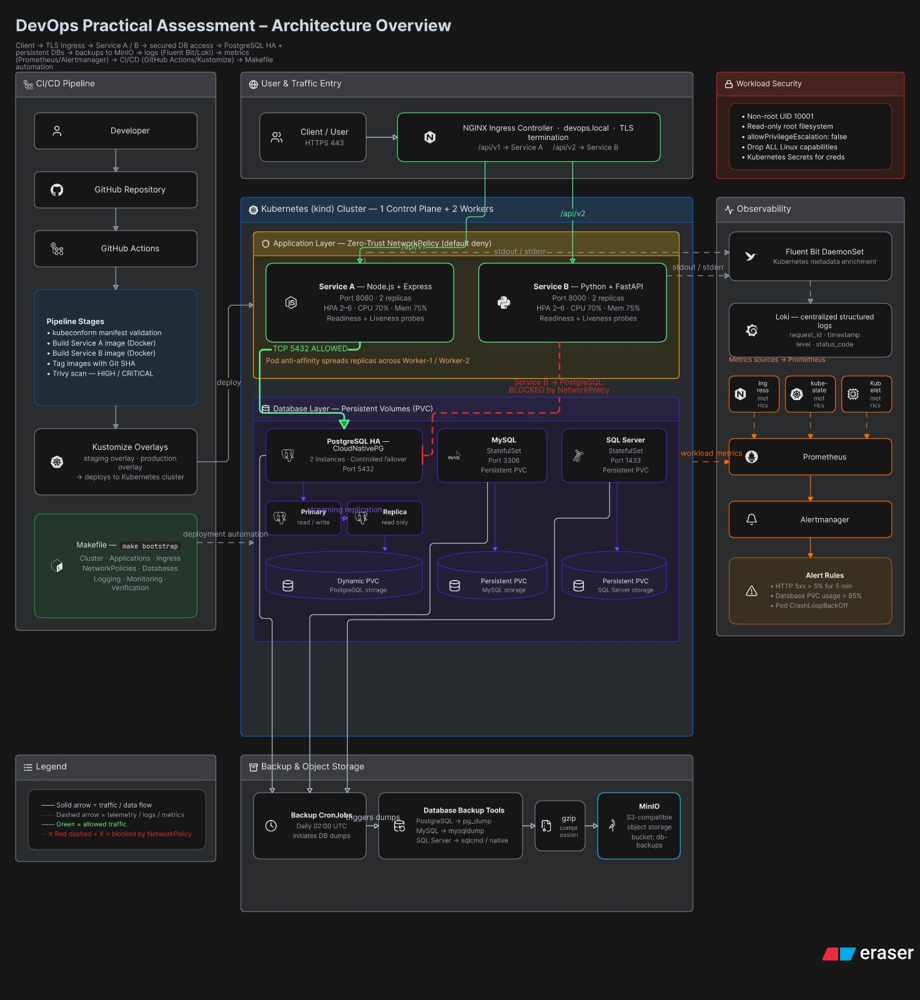

# DevOps Practical Assessment

A production-oriented DevOps practical assessment demonstrating containerization, Kubernetes orchestration, high-availability databases, persistent storage, automated backups, centralized logging, monitoring and alerting, CI/CD, environment overlays, security hardening, and deployment automation.

---

## Architecture Overview

The following architecture represents the complete platform implemented in this assessment.



### Architecture Highlights

- **Ingress:** NGINX Ingress Controller with TLS termination
- **Microservices:** Node.js/Express and Python/FastAPI
- **Scalability:** HPA using CPU and memory utilization
- **High Availability:** PostgreSQL primary/replica using CloudNativePG
- **Persistence:** PostgreSQL, MySQL, and SQL Server persistent storage
- **Security:** Zero-Trust NetworkPolicies and hardened containers
- **Backups:** Daily automated database backups to MinIO
- **Logging:** Fluent Bit and Loki
- **Monitoring:** Prometheus, kube-state-metrics, and Alertmanager
- **CI/CD:** GitHub Actions with validation and vulnerability scanning
- **Environments:** Kustomize staging and production overlays
- **Automation:** Makefile-based deployment and verification

---

## Short Description

This repository contains two polyglot microservices and the infrastructure required to run them on Kubernetes.

| Component | Technology |
|---|---|
| Service A | Node.js + Express |
| Service B | Python + FastAPI |
| Container Runtime | Docker |
| Kubernetes | kind |
| Ingress | NGINX Ingress |
| PostgreSQL HA | CloudNativePG |
| Databases | PostgreSQL, MySQL, Microsoft SQL Server |
| Object Storage | MinIO |
| Logging | Fluent Bit + Loki |
| Monitoring | Prometheus + Alertmanager |
| Kubernetes Metrics | kube-state-metrics |
| CI/CD | GitHub Actions |
| Environment Management | Kustomize |
| Automation | Makefile |

---

## Current Progress

- [x] STEP-01 Project structure setup
- [x] STEP-02 Service A implementation
- [x] STEP-03 Service B implementation
- [x] STEP-04 Docker containerization
- [x] STEP-05 Local Kubernetes cluster setup
- [x] STEP-06 Kubernetes application deployment
- [x] STEP-07 Kubernetes horizontal pod autoscaling
- [x] STEP-08 Kubernetes Ingress and TLS routing
- [x] STEP-09 Kubernetes Zero-Trust NetworkPolicy
- [x] STEP-10 PostgreSQL High Availability
- [x] STEP-11 MySQL and SQL Server Persistent Workloads
- [x] STEP-12 Automated Database Backup and S3-Compatible Storage
- [x] STEP-13 Centralized Logging with Fluent Bit and Loki
- [x] STEP-14 Prometheus Monitoring and Alerting
- [x] STEP-15 GitHub Actions CI/CD Pipeline
- [x] STEP-16 Kustomize Staging and Production Overlays
- [x] STEP-17 One-Click Deployment Automation
- [x] Kubernetes workload security hardening

---

# Service A — Node.js + Express

**Location:**

```text
docker/service-a
```

**Technology:**

```text
Node.js
Express
```

### Endpoints

```text
GET /api/v1/health
GET /api/v1/users
GET /api/v1/error
```

Health response:

```json
{
  "status": "healthy",
  "service": "service-a"
}
```

`/api/v1/error` intentionally returns HTTP 500 for monitoring and alert testing.

Runtime port:

```text
8080
```

---

# Service B — Python + FastAPI

**Location:**

```text
docker/service-b
```

**Technology:**

```text
Python 3
FastAPI
Uvicorn
```

### Endpoints

```text
GET /api/v2/health
GET /api/v2/orders
GET /api/v2/error
```

Health response:

```json
{
  "status": "healthy",
  "service": "service-b"
}
```

`/api/v2/error` intentionally returns HTTP 500 for monitoring and alert testing.

Runtime port:

```text
8000
```

### Run Service B Locally

Create and activate a virtual environment:

```bash
python3 -m venv .venv
source .venv/bin/activate
```

Install dependencies:

```bash
pip install -r docker/service-b/requirements.txt
```

Start the application:

```bash
uvicorn docker.service-b.main:app \
  --host 127.0.0.1 \
  --port 8000
```

Test:

```bash
curl http://127.0.0.1:8000/api/v2/health
curl http://127.0.0.1:8000/api/v2/orders
curl http://127.0.0.1:8000/api/v2/error
```

---

# STEP-04 — Docker Containerization

Both services use multi-stage Docker builds following production-oriented containerization practices.

### Docker Features

- Multi-stage builds
- Minimal runtime images
- Non-root execution
- UID `10001`
- Docker layer caching
- Build dependencies separated from runtime
- Reduced runtime attack surface

Service A and Service B build dependencies are installed in builder stages.

Only required runtime artifacts are copied into the final image.

Service B uses `python:3.12-slim` where the intended distroless Python image is unavailable.

### Build Service A

```bash
docker build \
  -f docker/service-a/Dockerfile \
  -t devops-service-a:step04 \
  docker/service-a
```

### Build Service B

```bash
docker build \
  -f docker/service-b/Dockerfile \
  -t devops-service-b:step04 \
  docker/service-b
```

Validated local image sizes:

```text
Service A: approximately 204 MB
Service B: approximately 159 MB
```

---

# STEP-05 — Local Kubernetes Cluster

A three-node Kubernetes cluster is created using kind.

### Cluster Configuration

```text
Cluster Name: devops-assessment

Nodes:
1 Control Plane
2 Worker Nodes
```

Host port mappings:

```text
80  -> HTTP
443 -> HTTPS
```

### Create Cluster

```bash
kind create cluster \
  --name devops-assessment \
  --config k8s/kind-config.yaml
```

### Verify

```bash
kubectl cluster-info --context kind-devops-assessment
kubectl get nodes -o wide
kubectl config current-context
```

### Delete Cluster

```bash
kind delete cluster --name devops-assessment
```

### Cluster Verification


---

# STEP-06 — Kubernetes Application Deployment

Both microservices are deployed as Kubernetes Deployments.

| Setting | Service A | Service B |
|---|---:|---:|
| Replicas | 2 | 2 |
| CPU Request | 100m | 100m |
| Memory Request | 128Mi | 128Mi |
| CPU Limit | 500m | 500m |
| Memory Limit | 256Mi | 256Mi |
| Health Endpoint | `/api/v1/health` | `/api/v2/health` |
| maxSurge | 25% | 25% |
| maxUnavailable | 0 | 0 |

Both deployments include:

- Resource requests
- Resource limits
- Readiness probes
- Liveness probes
- RollingUpdate strategy
- Required pod anti-affinity
- `kubernetes.io/hostname` topology distribution

### Apply Applications

```bash
kubectl apply -f k8s/base/service-a/deployment.yaml
kubectl apply -f k8s/base/service-a/service.yaml

kubectl apply -f k8s/base/service-b/deployment.yaml
kubectl apply -f k8s/base/service-b/service.yaml
```

### Verify

```bash
kubectl get deployments
kubectl get pods -o wide
kubectl get svc
```

### Deployment Verification


---

## Kubernetes Workload Security Hardening

Both application containers enforce a restrictive Kubernetes security context.

```yaml
securityContext:
  runAsNonRoot: true
  runAsUser: 10001
  allowPrivilegeEscalation: false
  readOnlyRootFilesystem: true
  capabilities:
    drop:
      - ALL
```

Because the root filesystem is read-only, a temporary writable filesystem is provided at `/tmp` using `emptyDir`.

```yaml
volumeMounts:
  - name: tmp
    mountPath: /tmp

volumes:
  - name: tmp
    emptyDir: {}
```

### Verify Security Context

```bash
kubectl get deployment service-a \
  -o jsonpath='{.spec.template.spec.containers[0].securityContext}{"\n"}'

kubectl get deployment service-b \
  -o jsonpath='{.spec.template.spec.containers[0].securityContext}{"\n"}'
```

Expected controls:

```text
runAsNonRoot: true
runAsUser: 10001
allowPrivilegeEscalation: false
readOnlyRootFilesystem: true
capabilities.drop: ALL
```

### Verify Rolling Strategy

```bash
kubectl get deployment service-a service-b \
  -o custom-columns='NAME:.metadata.name,READY:.status.readyReplicas,MAXSURGE:.spec.strategy.rollingUpdate.maxSurge,MAXUNAVAILABLE:.spec.strategy.rollingUpdate.maxUnavailable'
```

Validated configuration:

```text
NAME        READY   MAXSURGE   MAXUNAVAILABLE
service-a   2       25%        0
service-b   2       25%        0
```

---

# STEP-07 — Kubernetes Horizontal Pod Autoscaling

Horizontal Pod Autoscaling uses the Kubernetes `autoscaling/v2` API.

### HPA Configuration

For both services:

```text
Minimum replicas: 2
Maximum replicas: 6
CPU target: 70%
Memory target: 75%
Scale-down stabilization: 300 seconds
```

Metrics Server provides CPU and memory metrics.

### Verify

```bash
kubectl get hpa
kubectl top pods
kubectl top nodes
```

During load testing, Service A exceeded the CPU threshold and the HPA increased the desired replica count.

### Local Cluster Limitation

The kind cluster contains only two worker nodes.

Because strict required pod anti-affinity prevents multiple replicas of the same service from being scheduled on the same worker, the local topology limits the maximum simultaneously schedulable replicas.

The required anti-affinity configuration was intentionally retained.

### HPA Verification


---

# STEP-08 — Kubernetes Ingress and TLS

Ingress is implemented using ingress-nginx.

### Host

```text
devops.local
```

### Routing

```text
/api/v1 -> service-a:8080
/api/v2 -> service-b:8000
```

### TLS

TLS terminates at the Kubernetes Ingress.

TLS Secret:

```text
devops-local-tls
```

The certificate is self-signed for local assessment validation.

TLS private keys are not committed to Git.

### Test Service A

```bash
curl -k -i \
  --resolve devops.local:443:127.0.0.1 \
  https://devops.local/api/v1/health
```

### Test Service B

```bash
curl -k -i \
  --resolve devops.local:443:127.0.0.1 \
  https://devops.local/api/v2/health
```

HTTP traffic on port 80 is redirected to HTTPS.

Expected behavior:

```text
HTTP 308 Permanent Redirect
```

### Ingress and TLS Verification


---

# STEP-09 — Kubernetes Zero-Trust NetworkPolicy

The application layer uses a default-deny / explicit-allow network model.

### Security Model

```text
Default:
DENY ingress
DENY egress
```

Explicit rules allow only required communication.

### Allowed Traffic

```text
NGINX Ingress -> Service A : TCP/8080
NGINX Ingress -> Service B : TCP/8000
Service A     -> PostgreSQL: TCP/5432
```

Service B is not permitted to access PostgreSQL.

Unrelated application pods cannot directly access Service A or Service B.

### NetworkPolicy Verification


---

# STEP-10 — PostgreSQL High Availability

PostgreSQL HA is implemented using CloudNativePG.

### Configuration

```text
Cluster: postgres-ha
Instances: 2
Storage: Dynamic PVC
PVC Size: 1Gi per instance
StorageClass: standard
Replication: Streaming Replication
```

Validated capabilities:

- Primary/replica architecture
- Streaming replication
- Controlled failover
- Data persistence after failover
- Dynamic persistent storage
- Service A database access
- Service B database isolation

Credentials are stored using Kubernetes Secrets and are not committed to Git.

### Verify PostgreSQL Cluster

```bash
kubectl get cluster postgres-ha
```

### Verify Primary and Replica

```bash
kubectl get pods \
  -l cnpg.io/cluster=postgres-ha \
  -L role,cnpg.io/instanceRole
```

Validated state:

```text
Cluster: postgres-ha
Instances: 2
Ready: 2
Status: Cluster in healthy state

postgres-ha-1 -> primary
postgres-ha-2 -> replica
```

### PostgreSQL HA Verification


---

# STEP-11 — MySQL and SQL Server Persistent Workloads

## MySQL

Configuration:

```text
StatefulSet: mysql
Service: mysql
Port: 3306
Image: mysql:8.4
PVC: mysql-data-mysql-0
PVC Size: 1Gi
StorageClass: standard
```

Credentials are injected using:

```text
mysql-credentials
```

Persistence was verified by creating database data, deleting the MySQL pod, and confirming the data remained after pod recreation.

## Microsoft SQL Server

Configuration:

```text
StatefulSet: mssql
Service: mssql
Port: 1433
Image: mcr.microsoft.com/mssql/server:2022-latest
PVC: mssql-data-mssql-0
PVC Size: 2Gi
StorageClass: standard
```

Credentials are injected using:

```text
sqlserver-credentials
```

Persistence was also validated across pod recreation.

## Storage Configuration

Local kind storage:

```text
StorageClass: standard
Provisioner: rancher.io/local-path
ReclaimPolicy: Delete
VolumeBindingMode: WaitForFirstConsumer
```

### Volume Expansion Limitation

The local-path StorageClass does not advertise volume expansion.

For production environments, an expandable CSI-backed StorageClass should be used.

### Cross-Database Persistence Verification


---

# STEP-12 — Automated Database Backup and S3-Compatible Storage

Automated backup CronJobs are configured for all three databases.

### Schedule

```text
0 2 * * *
```

Timezone:

```text
Etc/UTC
```

This executes backups daily at:

```text
02:00 UTC
```

### Backup Tools

| Database | Tool |
|---|---|
| PostgreSQL | `pg_dump` |
| MySQL | `mysqldump` |
| SQL Server | `sqlcmd` / native `.bak` |

### Backup Flow

```text
PostgreSQL ─┐
            │
MySQL ──────┼──> Backup CronJobs
            │          │
SQL Server ─┘          v
                    gzip
                      │
                      v
                  MinIO S3
                      │
                      v
                 db-backups
```

MinIO provides S3-compatible object storage.

Bucket:

```text
db-backups
```

Database and MinIO credentials are injected using Kubernetes Secrets.

### Verify CronJobs

```bash
kubectl get cronjob
```

Validated:

```text
NAME              SCHEDULE    TIMEZONE
backup-mssql      0 2 * * *   Etc/UTC
backup-mysql      0 2 * * *   Etc/UTC
backup-postgres   0 2 * * *   Etc/UTC
```

### Verify Backup Jobs

```bash
kubectl get jobs
```

Validated manual backup Jobs:

```text
manual-backup-mssql            Complete
manual-backup-mysql-final      Complete
manual-backup-postgres-final   Complete
```

MinIO bucket creation:

```text
minio-create-db-backups-bucket   Complete
```

### Automated Backup Verification


---

# STEP-13 — Centralized Logging with Fluent Bit and Loki

The logging pipeline collects Kubernetes container logs centrally.

### Logging Architecture

```text
Service A stdout/stderr ─┐
                         │
Service B stdout/stderr ─┼──> Fluent Bit
                         │        │
Other Kubernetes Pods ───┘        v
                                Loki
```

### Fluent Bit

Fluent Bit runs as a Kubernetes DaemonSet.

Responsibilities:

- Collect container stdout/stderr
- Parse JSON application logs
- Add Kubernetes metadata
- Add namespace metadata
- Add pod/container metadata
- Forward logs to Loki

### Structured Application Fields

Validated fields include:

```text
timestamp
level
service
request_id
method
path
status_code
duration_ms
message
```

`trace_id` and `caller` are preserved if emitted by the applications, although the current sample services do not emit those fields.

### Verify Logging Components

```bash
kubectl get daemonset fluent-bit
kubectl get deployment loki
```

Validated state:

```text
Fluent Bit:
DESIRED: 3
CURRENT: 3
READY: 3
AVAILABLE: 3

Loki:
READY: 1/1
```

### Centralized Logging Verification


---

# STEP-14 — Prometheus Monitoring and Alertmanager

The Kubernetes monitoring stack includes:

```text
Prometheus
Alertmanager
kube-state-metrics
Ingress metrics
Kubelet metrics
```

### HighHTTP5xxRate

Detects:

```text
HTTP 5xx rate > 5%
Duration: 5 minutes
```

During validation, generated error traffic resulted in:

```text
HTTP 5xx rate: 76.92%
Alert state: pending
```

### PodCrashLoopBackOff

Detects containers entering:

```text
CrashLoopBackOff
```

A temporary test pod was used to validate the metric and alert condition.

### DatabasePVCUsageHigh

Configured threshold:

```text
PVC usage > 85%
```

The local kind environment uses:

```text
rancher.io/local-path
```

This environment did not expose:

```text
kubelet_volume_stats_used_bytes
```

Therefore, the PVC threshold was not artificially force-triggered.

The alert rule remains configured.

### Verify Monitoring Stack

```bash
kubectl get deployment \
  prometheus \
  alertmanager \
  kube-state-metrics
```

Validated state:

```text
prometheus           1/1
alertmanager         1/1
kube-state-metrics   1/1
```

### Monitoring and Alert Verification


---

# STEP-15 — GitHub Actions CI/CD Pipeline

GitHub Actions provides automated CI validation.

The pipeline performs:

1. Kubernetes manifest validation
2. Container image builds
3. Git SHA image tagging
4. Trivy vulnerability scanning

### Manifest Validation

Kubernetes manifests are validated using:

```text
kubeconform
```

### Container Security

Both images are scanned using:

```text
Trivy
```

Severity scope:

```text
HIGH
CRITICAL
```

### Image Tagging

Container images are tagged using the Git commit SHA to provide traceability between source code and container builds.

---

# STEP-16 — Kustomize Environment Overlays

Kustomize separates reusable base manifests from environment-specific configuration.

### Structure

```text
k8s/
├── base/
│   ├── service-a/
│   ├── service-b/
│   ├── ingress/
│   └── network-policies/
│
└── overlays/
    ├── staging/
    └── production/
```

### Staging

Staging resources use:

```text
environment: staging
-staging name suffix
```

### Production

Production resources use:

```text
environment: production
-production name suffix
```

### Validate Staging

```bash
kubectl kustomize k8s/overlays/staging
```

### Validate Production

```bash
kubectl kustomize k8s/overlays/production
```

---

# STEP-17 — One-Click Deployment Automation

The repository contains a Makefile for repeatable local deployment and verification.

### Available Targets

```bash
make help
make cluster
make apps
make ingress
make network
make databases
make logging
make monitoring
make verify
make all
make bootstrap
```

### Bootstrap

```bash
make bootstrap
```

The automation creates or reuses the configured kind cluster and applies the configured:

```text
Applications
Ingress resources
NetworkPolicies
Database workloads
Logging stack
Monitoring stack
```

It then runs platform verification.

## Bootstrap Prerequisites

Some supporting components and runtime secrets are intentionally not committed to Git.

A fresh environment must have the required Kubernetes controllers/operators and generated runtime Secrets available for workloads that depend on them.

This includes components such as:

- ingress-nginx
- Metrics Server
- CloudNativePG operator
- required database Secrets
- MinIO credentials
- TLS Secret

No plaintext credentials or TLS private keys are stored in Git.

---

# Final Verification Runbook

The following commands provide a quick operational verification of the complete platform.

---

## 1. Overall Platform Health

```bash
make verify
```

Validated cluster state:

```text
Kubernetes Nodes:       3 Ready

Service A:              2/2
Service B:              2/2

MySQL:                  1/1
SQL Server:             1/1
MinIO:                  1/1

Prometheus:             1/1
Alertmanager:           1/1
kube-state-metrics:     1/1
Loki:                   1/1

Fluent Bit:             3/3
```

Ingress:

```text
Host: devops.local
Ports: 80, 443
TLS: Enabled
```

---

## 2. PostgreSQL HA Verification

```bash
kubectl get cluster postgres-ha
```

Validated:

```text
NAME          INSTANCES   READY   STATUS
postgres-ha   2           2       Cluster in healthy state
```

Check primary and replica:

```bash
kubectl get pods \
  -l cnpg.io/cluster=postgres-ha \
  -L role,cnpg.io/instanceRole
```

Validated:

```text
postgres-ha-1   primary
postgres-ha-2   replica
```

---

## 3. Centralized Logging Verification

```bash
kubectl get daemonset fluent-bit
kubectl get deployment loki
```

Validated:

```text
Fluent Bit: 3/3 Ready
Loki:       1/1 Ready
```

---

## 4. Monitoring Verification

```bash
kubectl get deployment \
  prometheus \
  alertmanager \
  kube-state-metrics
```

Validated:

```text
Prometheus:           1/1
Alertmanager:         1/1
kube-state-metrics:   1/1
```

---

## 5. Backup Verification

```bash
kubectl get cronjob
kubectl get jobs
```

Validated CronJobs:

```text
backup-postgres   0 2 * * *   Etc/UTC
backup-mysql      0 2 * * *   Etc/UTC
backup-mssql      0 2 * * *   Etc/UTC
```

Validated manual backup Jobs:

```text
manual-backup-postgres-final   Complete
manual-backup-mysql-final      Complete
manual-backup-mssql            Complete
```

---

## 6. Security Verification

Check Service A:

```bash
kubectl get deployment service-a \
  -o jsonpath='{.spec.template.spec.containers[0].securityContext}{"\n"}'
```

Check Service B:

```bash
kubectl get deployment service-b \
  -o jsonpath='{.spec.template.spec.containers[0].securityContext}{"\n"}'
```

Expected:

```json
{
  "allowPrivilegeEscalation": false,
  "capabilities": {
    "drop": [
      "ALL"
    ]
  },
  "readOnlyRootFilesystem": true,
  "runAsNonRoot": true,
  "runAsUser": 10001
}
```

---

## 7. Rolling Update Verification

```bash
kubectl get deployment service-a service-b \
  -o custom-columns='NAME:.metadata.name,READY:.status.readyReplicas,MAXSURGE:.spec.strategy.rollingUpdate.maxSurge,MAXUNAVAILABLE:.spec.strategy.rollingUpdate.maxUnavailable'
```

Validated:

```text
NAME        READY   MAXSURGE   MAXUNAVAILABLE
service-a   2       25%        0
service-b   2       25%        0
```

### Local Rolling-Update Capacity Note

The local environment has two worker nodes with strict required pod anti-affinity.

A zero-unavailable rollout (`maxUnavailable: 0`) can require an additional scheduling slot while replacing existing replicas.

This is a local topology constraint rather than an application failure. A production cluster with additional worker capacity would provide the required scheduling headroom.

---

# Security Controls

The platform implements multiple security layers.

### Container Security

```text
Non-root UID: 10001
Read-only root filesystem
Privilege escalation disabled
All Linux capabilities dropped
```

### Kubernetes Security

```text
Zero-Trust NetworkPolicies
Default deny
Explicit ingress rules
Restricted database connectivity
Pod anti-affinity
```

### Secrets

Sensitive credentials are externalized using Kubernetes Secrets.

The repository does not intentionally store:

```text
Database passwords
MinIO passwords
TLS private keys
.env credential files
```

### CI Security

GitHub Actions runs Trivy vulnerability scanning for:

```text
HIGH
CRITICAL
```

container vulnerabilities.

---

# Disaster Recovery

The project provides multiple data-protection mechanisms.

### PostgreSQL

```text
CloudNativePG
Primary + Replica
Streaming replication
Controlled failover
Persistent PVCs
```

### Database Backups

```text
Daily schedule: 02:00 UTC

PostgreSQL -> pg_dump
MySQL      -> mysqldump
SQL Server -> sqlcmd/native backup

Compression -> gzip
Storage     -> MinIO / S3-compatible object storage
```

---

# Observability

The observability architecture contains both logs and metrics.

### Logging

```text
Kubernetes Pods
      |
      v
 Fluent Bit
      |
      v
    Loki
```

### Monitoring

```text
Ingress Metrics ───────┐
                       |
Kubernetes Metrics ────┼──> Prometheus
                       |         |
Kubelet Metrics ───────┘         v
                             Alertmanager
```

Configured alert scenarios:

```text
HTTP 5xx > 5% for 5 minutes
Database PVC > 85%
CrashLoopBackOff
```

---

# CI/CD Flow

```text
Developer
    |
    v
GitHub Repository
    |
    v
GitHub Actions
    |
    +--> kubeconform
    |
    +--> Build Service A
    |
    +--> Build Service B
    |
    +--> SHA Image Tagging
    |
    +--> Trivy Scan
    |
    v
Kustomize
    |
    +--> Staging
    |
    └--> Production
```

---

# Repository Structure

```text
.
├── .github/
│   └── workflows/
│
├── ci/
│   └── README.md
│
├── helm/
│   └── README.md
│
├── scripts/
│   └── README.md
│
├── backup/
│
├── database/
│   ├── postgres/
│   ├── mysql/
│   └── mssql/
│
├── docker/
│   ├── service-a/
│   └── service-b/
│
├── k8s/
│   ├── base/
│   │   ├── service-a/
│   │   ├── service-b/
│   │   ├── ingress/
│   │   └── network-policies/
│   │
│   └── overlays/
│       ├── staging/
│       └── production/
│
├── monitoring/
│   ├── logging/
│   └── prometheus/
│
├── docs/
│   ├── architecture/
│   │   └── devops-architecture-overview.png
│   │
│   └── screenshots/
│       ├── step-05-kind-cluster.png
│       ├── step-06-kubernetes-deployment.png
│       ├── step-07-hpa-verification.png
│       ├── step-08-ingress-tls-verification.png
│       ├── step-09-network-policy-verification.png
│       ├── step-10-postgresql-ha-verification.png
│       ├── step-11-cross-database-persistence.png
│       ├── step-12-backup-verification.png
│       ├── step-13-centralized-logging.png
│       └── step-14-prometheus-alerting.png
│
├── Makefile
└── README.md
```

---

# Assessment Coverage

This repository demonstrates:

- Multi-stage Docker builds
- Minimal runtime images
- Docker layer caching
- Non-root containers
- Kubernetes securityContext
- Read-only root filesystems
- Linux capability dropping
- Kubernetes Deployments
- Kubernetes Services
- Resource requests and limits
- Readiness probes
- Liveness probes
- Rolling updates
- Pod anti-affinity
- Horizontal Pod Autoscaling
- CPU-based scaling
- Memory-based scaling
- NGINX Ingress
- TLS termination
- Host/path routing
- Zero-Trust NetworkPolicies
- PostgreSQL HA
- Streaming replication
- PostgreSQL failover
- MySQL StatefulSet
- Microsoft SQL Server StatefulSet
- Persistent volumes
- Dynamic storage
- Kubernetes Secrets
- Automated database backups
- S3-compatible object storage
- gzip backup compression
- Fluent Bit
- Loki
- Structured JSON logging
- Kubernetes metadata enrichment
- Prometheus
- kube-state-metrics
- Alertmanager
- HTTP 5xx alerting
- PVC usage alerting
- CrashLoopBackOff alerting
- GitHub Actions
- kubeconform
- Trivy vulnerability scanning
- SHA-tagged image builds
- Kustomize staging overlay
- Kustomize production overlay
- Makefile deployment automation
- Operational verification runbook

---

# Known Local Environment Limitations

This project intentionally documents local-environment constraints instead of hiding or simulating unsupported behavior.

### PVC Metrics

The kind `rancher.io/local-path` environment did not expose:

```text
kubelet_volume_stats_used_bytes
```

The PVC >85% alert rule is configured but was not artificially force-triggered.

### Volume Expansion

The local-path StorageClass does not advertise volume expansion.

A production environment should use an expandable CSI-backed StorageClass.

### HPA and Anti-Affinity

The local cluster has only two worker nodes.

Required pod anti-affinity therefore limits the maximum number of simultaneously schedulable replicas for each application.

### Rolling Updates

Strict pod anti-affinity combined with:

```text
maxSurge: 25%
maxUnavailable: 0
```

requires additional scheduling capacity during a rolling replacement.

Production clusters should provide sufficient worker-node capacity for zero-unavailable rollouts.

---

# Final Status

The complete DevOps assessment stack has been implemented and locally validated on the `devops-assessment` Kubernetes cluster.

The final environment includes:

```text
3 Kubernetes Nodes

2 Service A Pods
2 Service B Pods

2 PostgreSQL HA Instances
1 MySQL Instance
1 SQL Server Instance

1 MinIO Instance

3 Fluent Bit Pods
1 Loki Instance

1 Prometheus Instance
1 Alertmanager Instance
1 kube-state-metrics Instance

NGINX Ingress with TLS
Zero-Trust NetworkPolicies
Horizontal Pod Autoscaling
Automated Database Backups
GitHub Actions CI/CD
Kustomize Environment Overlays
Hardened Kubernetes Workloads
Makefile Deployment Automation
```

All major assessment components have been implemented, tested, documented, and verified.
---

# GitOps Delivery Choice

The assessment supports either **Helm Charts or Kustomize overlays** for environment-specific Kubernetes delivery.

This implementation uses **Kustomize** as the primary GitOps configuration mechanism:

- `k8s/base/` contains reusable Kubernetes resources.
- `k8s/overlays/staging/` contains staging-specific configuration.
- `k8s/overlays/production/` contains production-specific configuration.
- `helm/` is retained as part of the required repository structure and documents the option for future Helm packaging.
- `ci/` documents the CI/CD implementation, while the active GitHub Actions workflow is stored under `.github/workflows/`.
- `scripts/` documents deployment automation provided through the root `Makefile`.

Kustomize was selected instead of duplicating the same deployment configuration in both Helm and Kustomize.
